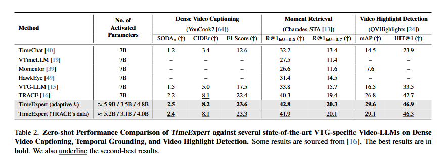

[](https://arxiv.org/abs/2508.01699)
[](https://github.com/Naereen/StrapDown.js/blob/master/LICENSE)

<div align="center">
<h1>TimeExpert: An Expert-Guided Video LLM for Video Temporal Grounding [<a href="https://arxiv.org/abs/2508.01699">Paper</a>] [<a href="https://mwxely.github.io/projects/yang2025time/index">Project Page</a>] [<a href="https://huggingface.co/mwxely/TimeExpert-10B">Model</a>]</h1>

<div>
    <a href='https://mwxely.github.io/' target='_blank'>Zuhao Yang†</a> 
</div>

<div>
    Nanyang Technological University
</div>
</div>

## Dates

- [06.26] Accepted with Score **(5/5/4)**. Thanks for my reviewers!!
- [10.25] In person at Hawaii. Feel free to chat.
- [10.26] Code released.

## TODO

Code will come soon. Feel free to chat with me via wechat if you have problem: YZH__leo.

- [x] Paper accepted by ICCV.
- [x] Release [TimeExpert](https://huggingface.co/mwxely/TimeExpert-10B).
- [ ] Release inference code.
- [ ] Release training code.

## Abstract

Video Temporal Grounding (VTG) aims to precisely identify video event segments in response to textual queries. The outputs of VTG tasks manifest as sequences of events, each defined by precise timestamps, saliency scores, and textual descriptions. Despite recent advances, a fundamental limitation persists in existing Video Large Language Models (Video-LLMs): they process all task tokens through identical and static pathways, failing to recognize that temporal localization, saliency assessment, and textual generation represent fundamentally distinct tasks requiring specialized processing. To address this, we introduce TimeExpert, a Mixture-of-Experts (MoE)-based Video-LLM that effectively decomposes VTG tasks by dynamically routing task-specific tokens (e.g., timestamps, saliency scores) to specialized experts, with increased computational efficiency. Our design choices enable precise handling of each subtask, leading to improved event modeling across diverse VTG applications. Extensive experiments demonstrate that TimeExpert consistently achieves state-of-the-art performance on various VTG tasks such as Dense Video Captioning, Moment Retrieval, and Video Highlight Detection. 

## Results

We achieve the SoTA results for multiple TVG tasks, including Dense Video Captioning, Temporal Video Grounding, beating previous approaches by large margins.



## :love_you_gesture: Citation

If you find our work useful for your research, please consider citing the paper:

```bibtex
@inproceedings{yang2025timeexpert,
    title={TimeExpert: An Expert-Guided Video LLM for Video Temporal Grounding},
    author={Yang, Zuhao and Yu, Yingchen and Zhao, Yunqing and Lu, Shijian and Bai, Song},
    booktitle={Proceedings of the IEEE/CVF International Conference on Computer Vision},
    year={2025}
}
```
